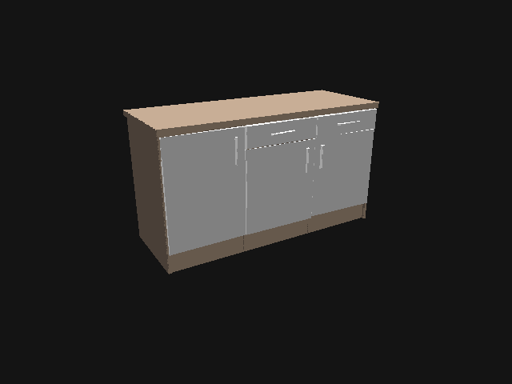

# ED submodel_states
This repository extends the modeling features of [ED](https://github.com/tue-robotics/ed)
with additional parameters.

## Getting started
``` shell
# Get dependencies for ed (see: https://github.com/tue-robotics/ed#Installation)
sudo apt-get install ros-kinetic-geometry-msgs ros-kinetic-pcl-ros ros-kinetic-message-filters ros-kinetic-image-geometry ros-kinetic-kdl-parser ros-kinetic-roslib ros-kinetic-std-srvs libyaml-cpp-dev ros-kinetic-cv-bridge ros-kinetic-tf libassimp-dev ros-kinetic-message-generation ros-kinetic-roscpp ros-kinetic-message-runtime ros-kinetic-class-loader


# Move to catkin workspace
roscd; cd ../src;

# Fetch dependencies
git clone https://github.com/iki-wgt/ed.git
cd ed; git checkout submodel_states; cd ..
git clone https://github.com/tue-robotics/ed_object_models.git
git clone https://github.com/tue-robotics/ed_msgs.git
git clone https://github.com/tue-robotics/code_profiler.git
git clone https://github.com/tue-robotics/geolib2.git
git clone https://github.com/tue-robotics/rgbd.git
git clone https://github.com/tue-robotics/tue_config.git
git clone https://github.com/tue-robotics/tue_filesystem.git
git clone https://github.com/tue-robotics/tue_serialization.git
git clone https://github.com/iki-wgt/ed_sensor_integration.git
cd ed_sensor_integration; git checkout submodel_states; cd ..

# Move to catkin and start build
roscd; cd ..; catkin_make
```

## External dependencies
- [ed (Branch submodel_states)](https://github.com/iki-wgt/ed/tree/submodel_states)
- [ed_sensor_integration (Branch submodel_states)](https://github.com/iki-wgt/ed_sensor_integration/tree/submodel_states)
- [ed_object_models](https://github.com/tue-robotics/ed_object_models.git)  
- [ed_msgs](https://github.com/tue-robotics/ed_msgs.git)  
- [code_profiler](https://github.com/tue-robotics/code_profiler.git)  
- [geolib2](https://github.com/tue-robotics/geolib2.git)  
- [rgbd](https://github.com/tue-robotics/rgbd.git)  
- [tue_config](https://github.com/tue-robotics/tue_config.git)  
- [tue_filesystem](https://github.com/tue-robotics/tue_filesystem.git)  
- [tue_serialization](https://github.com/tue-robotics/tue_serialization.git)  

## Build dependencies
 - No Dockerfile

## Run dependencies
 - Working ED_Config.yaml [(see ed tutorial)](https://github.com/tue-robotics/ed_tutorials)
 - Working ED_Model.yaml [(see ed tutorial)](https://github.com/tue-robotics/ed_tutorials)

## Additional parameters to ed

Adds additional optional parameters to default ed model yaml files. These additional parameters are used by the [ed_sensor_integration package on the branch (submodel_states)](https://github.com/iki-wgt/ed/tree/submodel_states)

Super_model_of_a_thing.yaml:
``` yaml
composition:
- id: main_part_id
  type: thing/main_part
  pose: { x: 0.0, y: 0.0, z: 0}
  state-update-group: group_name_xyz
  flags:
    - flag: state-update-group-main

- id: big-door
  type: thing/submodel
  pose: { x: -0.282, y: 0.742, z: 0.470, Z: 3.14}
  state-update-group: group_name_xyz

- [...]

state-update-group: group_name_xyz
flags:
  - flag: state-update-group-composition

```
 - state-update-group: Connects multiple objects in one group. This group will be treated differently in an update to enable submodel updates.

 - flag state-update-group-main: One object of a state-update-group should be the main_part. This should be the object, which connects all submodels. If the main_part of a group is updated all its submodels will be moved/rotated with the main_part. E.g. if the main body of a cabinet is moved in the model all its drawers/doors will move with it.

 - flag state-update-group-composition: If the composition itself is updated, this flag will redirect the update from the composition to the main_part of the state-update-group.


Sub_model_of_a_thing.yaml:
``` yaml
# standard yaml
shape:
  group:
  - box:
      pose: {x: 0.00, y: 0.0, z: -0.0325}
      size: {x: 0.40, y: 0.458, z: 0.01}

color: {blue: 1.0, green: 1.0, red: 1.0}

[...]


# additional parameters from this extension
state_update: #
  ROI: {z_min: -0.06, z_max: 0.06, mode: "include"}
  degrees_of_freedom:
    rotation: false
    translation: true
    translation_restriction: {x: 0, y: 1}
  state_definitions: {close: 0.0 , open: 0.2925, mode: "linear"}
```

 - state_update:
   - ROI: Region of interest. Defines an height area between z_min and z_max in the object space, where rgbd sensor values should be filtered/not filtered (mode: "exclude"/"include"). Use this to enhance the sensor data to exclude non relevant data.
   - degrees_of_freedom: Restrict the movement of the submodel.
     - rotation: Can the submodel rotate? Doors -> Yes, Drawers -> No
     - translation: Can the center of the submodel be moved? Doors -> No (If the center of the door is at the hinge), Drawers -> Yes
     - translation_restriction: On which vector/axis can the submodel be moved?



  - state_definitions: Defines two states relative to the initial position. The [ed_sensor_integration (submodel_states)](https://github.com/iki-wgt/ed/commits/submodel_states) package uses this information to gain state information by interpolating between the closed and open value.
    - mode "linear": Close and open correspond to the absolute distance of the initial position.
    - mode "angle": Close and open correspond to clockwise difference in angle to the initial pose.


## Authors
 - Jakob Fichtl - _Main Contributor_ - @jf-171197
 - Michael Zappe - _Contributor_ - @mz-171742

## License
 - To be determined.
